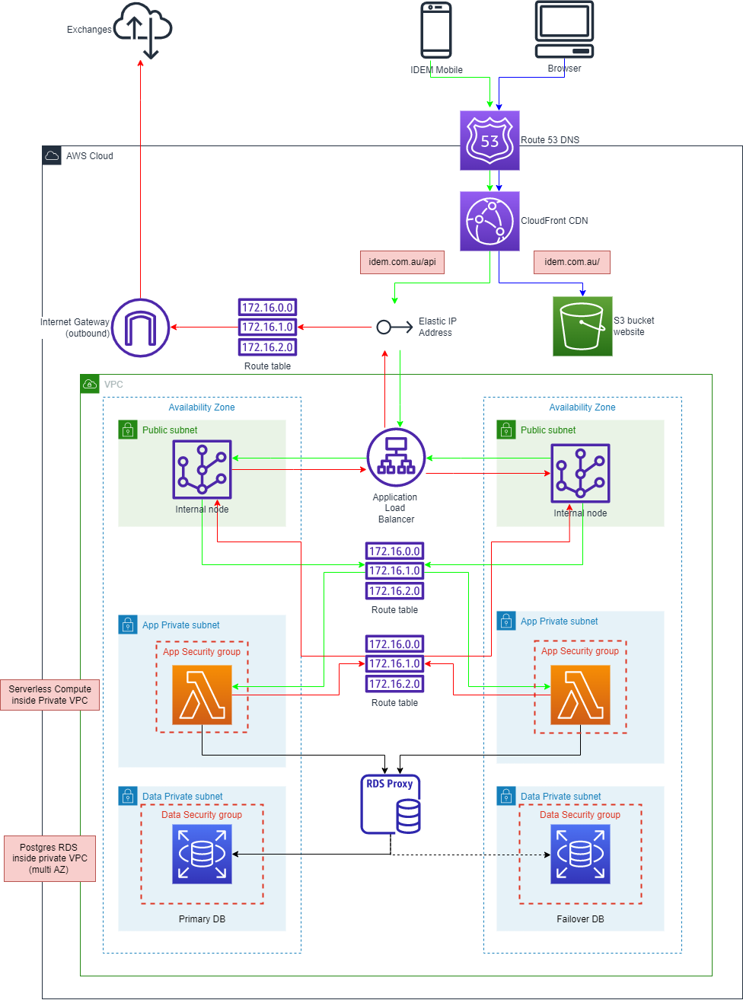

# Architecture

## Prototype 
Drawn in [Excalidraw](https://excalidraw.com/)

## AWS
Architectural roadmap for production infrastructure

Key details
* AWS reference architecture for multi-az 3-tier webapp
* Serverless scalability via Lambda + connection pooling via RDS proxy
* RDS accessible via bastion host (not pictured) and can be upgraded to Aurora 
* Elastic IP for whitelisting outbounding traffic to Exchanges
* CloudFront CDN for firewall and DDOS protection
* S3 bucket for static website

**TODO pgp server**

Drawn in [Diagrams.net](https://app.diagrams.net/)

